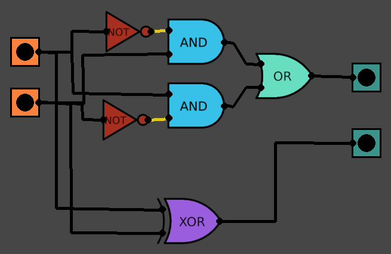
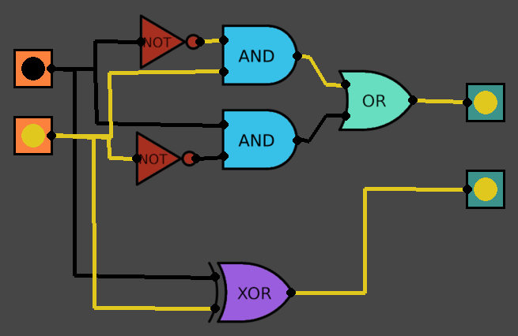
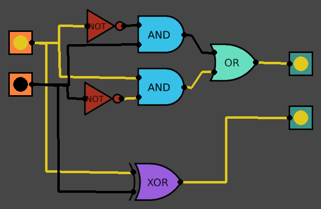
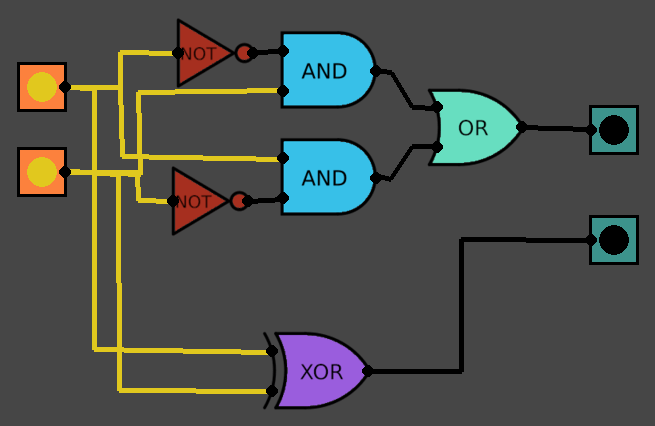
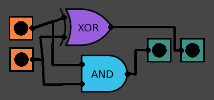
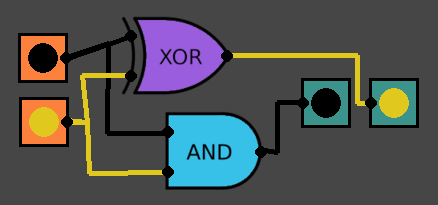
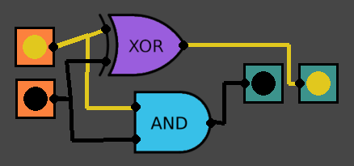
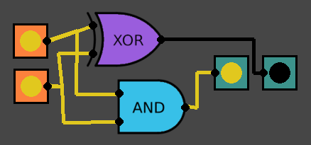
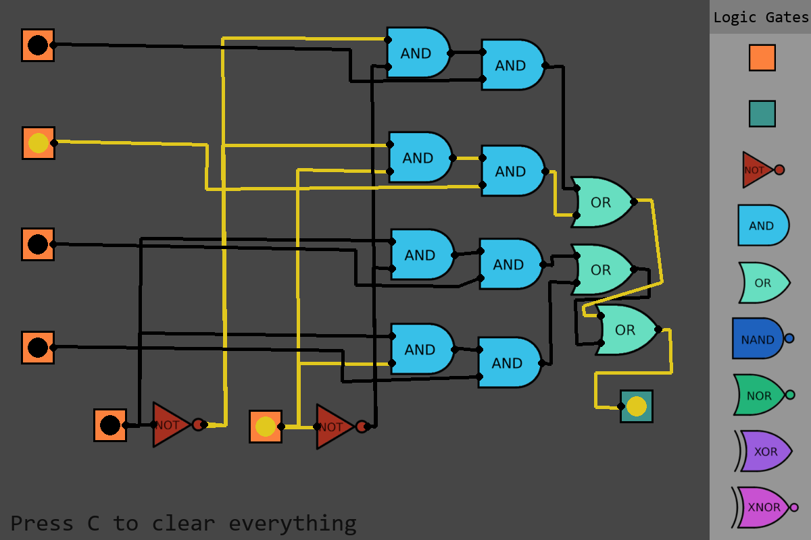
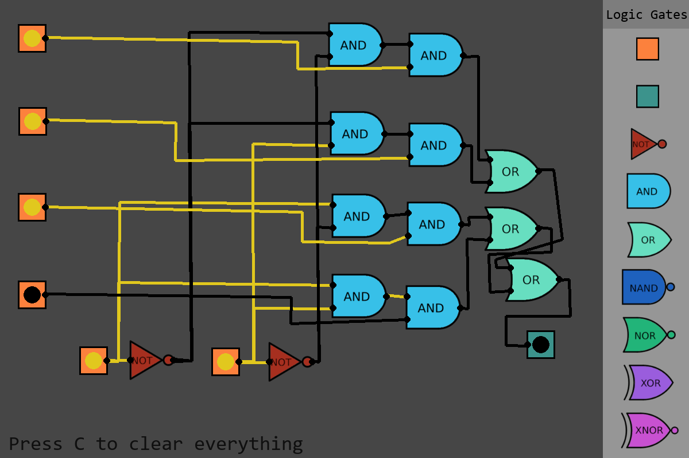

# Logic Circuit Designer

## Introduction
This project is a very simple logic gate simulation made in python for my school project. It uses pygame for the GUI support.

It allows the user to drag and drop logic gates and inputs/outputs, make necessary connections and view the system state in real time as the inputs are altered.

## Screenshots

### XOR Implementation

### Half Adder

### Multiplexer

## Usage
Make sure you have Python installed

Install pygame (preferably in a virtual environment) with pip using:\
`pip install pygame`

Run the main python file\
`python src/main.py`

